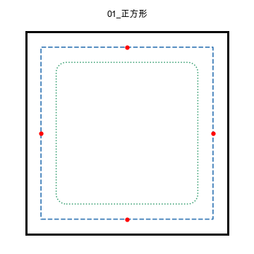

# 几何拼接片（Geometric Tiles）

给 3D 打印机的几何拼片工坊：**每 40mm 边 1 个卡扣**，相同规格的拼片可以互相拼接。
在浏览器里选形状 → 调尺寸/镂空 → 屏幕确认能拼 → 下载 STL 直接切片打印。



## 特性

- **形状**：自由多边形（3–12 边）、正多边形、直线边、凸弧/凹弧；多解选择（如正五边形/正六边形的 2 个解）
- **标准单元体系**：40mm 单元边 + 每边 1 卡扣；40mm 倍数边长自动拆成倍数个单元边（= 倍数个卡扣）
- **预设库**：三角形/四边形/五边形/六边形/其他多边形/曲边多边形 6 大类 40+ 变体，
  含彭罗斯密铺四件（胖/瘦菱形、盾牌、飞镖）、开罗五边形、皇冠型、五角星、银杏叶密铺、银锭形等
- **几何细节**：P1/P2 严格等距内缩参考线、P1 顶点 0.05mm 圆角、轮廓包边（凹角分段）、
  镂空（3mm 夹层 + 内孔倒角圆角）、卡扣垂足锚点与悬出检测
- **预览**：2D 小图（轮廓/卡扣外沿/镂空内沿/卡扣位置）+ 3D 大图（自动刷新 + 两片装配预览）
- **下载**：中文文件名即规格（如 `大正方形_80_镂空.stl`），RFC5987 编码，直接丢切片软件
- **物料估算**：按 2 壁 + 顶底 5 层 + 15% 填充近似估算打印重量与成本

## 环境要求

- Python 3.9+
- `build123d==0.8.0`（几何内核，依赖 OpenCASCADE）
- 现代浏览器（Chrome/Safari/Edge，需支持 ES module 与 WebGL）

```bash
pip install -r requirements.txt
```

## 启动

```bash
python3 tile_generator_v3.py
```

浏览器访问 http://127.0.0.1:8768 （启动时会自动打开）。
**注意**：3D 构建在独立子进程执行，修改后端代码后需重启服务；前端改动刷新页面即可。

## 使用

1. 左栏「选择形状」：点一级卡片（三角形/四边形/五边形/六边形/其他多边形/曲边多边形）→ 选变体
2. 左栏「尺寸与细节」：镂空开关 + 每条边/每个可调角的滑轨（微调任意参数即转为自由多边形）
3. 中栏：2D 小图与 3D 预览（参数变化约 1 秒后自动刷新）；可开关「两片装配」预览
4. 右栏：「下载3D模型」按钮保存 STL；右栏底部「高级（开发者）」可粘贴参数用例、复制当前用例

### 参数用例格式（高级区可粘贴）

```
58（凹弧，R40），40，40，40；角107.4°；解2
```

## 测试

```bash
python3 test_wrap_segments.py
```

31 个回归用例（形状构建 + 卡扣连接 + 包边分段），输出 `valid/solids/connected/clips/包边段/体积` 等指标。
更完整的验收矩阵（崩溃边界、包边完整性、密铺件实际角）见 `docs/复现需求文档_V3.md` 第 4、7 节。

## 项目结构

```
tile_generator_v3.py      后端：HTTP 服务 + 几何引擎（形状求解/内缩/圆角/卡扣/包边/布尔/STL）
tile_generator_v3.html    前端：单文件应用（原生 JS + Three.js，无构建工具）
卡扣元件.step              卡扣几何元件（安装面 + 外伸咬合结构，厚度 3mm）
test_wrap_segments.py     回归测试
vendor/three/             three.js（MIT，本地化以便离线运行）
docs/                     阶段文档、需求规格、测试用例图册
```

## 已知限制

- 部分退化形状（边过短、凹角 + 弧组合等）会被按段跳过并给出提示；极少数用例的卡扣可能无法连接
- 底层布尔运算在个别几何上可能非常慢（已内置看门狗：单次构建超时 60s 自动中止并恢复服务）
- 仅桌面浏览器适配；暂不支持移动端

## 文档

- `docs/复现需求文档_V3.md` —— 完整需求规格 + 参数全集 + 验收标准（从零复现用）
- `docs/上下文压缩_V3阶段总结.md` —— 功能与参数全集、关键技术决策
- `docs/界面产品化_需求梳理.md` —— 界面需求基准
- `docs/测试用例图册/` —— 14 张 2D 轮廓示例图

## 版本说明

本仓库为 **V3 重写版**（当前主力版本）：自由多边形/弧边、P1-P2 参考线、包边、镂空、
预设配方体系。早期 V2 原型（从正三角形起步的独立实现）**未包含**在本仓库中。

## 许可证

[Apache License 2.0](LICENSE)。第三方组件：build123d/OpenCASCADE（Apache-2.0）、three.js（MIT）。
